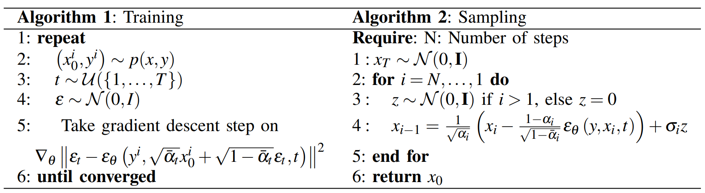

VDT2023_MRI2CT: Conversion Between CT and MRI Images Using Diffusion Model

Training and sampling procedure:


First create venv and isntall all requirements
```
conda create -n [env_name] python=3.9
conda activate [env_name]
cd VDT2023_MRI2CT
pip install -r requirments.txt
```

Download dataset from [here](https://drive.google.com/file/d/1TRqkF2EJiXT4RwlaSkrYrDrCS-TsyNnM/view?usp=sharing) and put it inside ```.\dataset``` .
Download checkpoints from [here](https://drive.google.com/drive/folders/1Bcrc3SkgXY8OOMhD3d-pmwGycMqt7dKM?usp=sharing) and put them into ```\eperiments\mri2ct_230603_193325\checkpoint\```

To start the training process
```
python sr.py -c config/mri2ct.json 
```
The ```gpu_id``` is set as ```'0'``` by default.
To infer
```
python infer.py
```
Some qualitative results


# Acknoledgement 
Lastly, I want to thank [janspiry](https://github.com/Janspiry/Image-Super-Resolution-via-Iterative-Refinement) for such a wonderful and quality repository. I learned a lot from his/her repo design.
